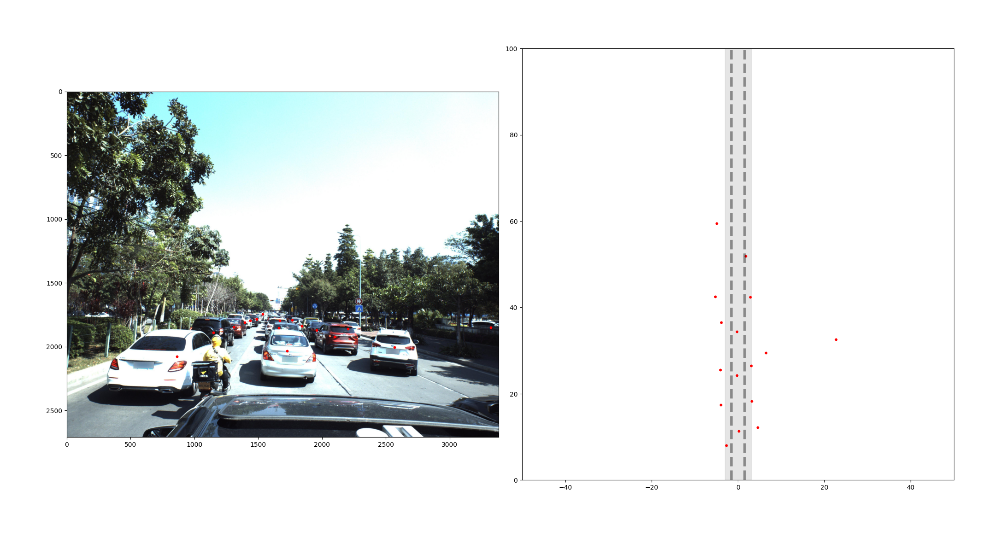

# Camera calibration practice
카메라 보정과 관련하여 [참고한 내용](https://www.notion.so/Camera-calibration-a70c0c1d7a3a4046ad010997f9a22000?pvs=4)은 노션에 정리하였습니다.

먼저, 카메라의 파라미터는 다음과 같습니다.

fx = 2304.5479  
fy = 2305.8757  
cx = 1686.2379  
cy = 1354.9849
```python
intrinsic_matrix = np.array([[2304.5479,   0,          1686.2379],
                          [0,           2305.8757,  1354.9849],
                          [0,           0,          1        ]], 
                         dtype=np.float32)
```
## Intrinsic matrix
Annotation에 주어진 Camera 좌표계 상의 x, y, z를 intrinsic matrix와 곱하여 Image 좌표계로 변환합니다. 이떄, z는 초점거리 f는 z와 같기 때문에 x와 y를 z로 나눠주었습니다.
```python
def coords2imgcoords(coords, intrinsic_matrix):
    xs = [c['x'] for c in coords]
    ys = [c['y'] for c in coords]
    zs = [c['z'] for c in coords]
    P = np.array(list(zip(xs, ys, zs))).T    # (n,3)->(3,n)
    img_p = np.dot(intrinsic_matrix, P).T    # (3,3)@(3,n) -> (3,n)
    # Intrinsic matrix @ 3d point
     
    img_p[:, 0] /= img_p[:, 2]
    img_p[:, 1] /= img_p[:, 2]
    img_xs = img_p[:, 0]
    img_ys = img_p[:, 1]
    img_zs = img_p[:, 2] # z = Distance from the camera
    return img_xs, img_ys
```
## 결과


## Projection matrix (Intrinsic matrix @ Extrinsic matrix)

Annotation 정보에 있는 차량들의 회전 각도를 Image 좌표계로 투영하기 위한 회전 행렬을 만든다.  
yaw@pitch@roll = rotation matrix
```python
def euler_to_Rot(yaw, pitch, roll): 
    X_p = np.array([[1,            0,           0],
                    [0,   cos(pitch), -sin(pitch)],
                    [0,   sin(pitch),  cos(pitch)]])
    
    Y_y = np.array([[cos(yaw),    0,  sin(yaw)],
                    [        0,   1,         0],
                    [-sin(yaw),   0,  cos(yaw)]])

    Z_r = np.array([[cos(roll),   -sin(roll), 0],
                    [sin(roll),    cos(roll), 0],
                    [        0,            0, 1]])
    return np.dot(Y_y, np.dot(X_p, Z_r))
```
Projection matrix를 이용하여 Wolrd 좌표계의 차량을 Image 좌표계로 투영하는 과정이다.  
x_l = 1.02  
y_l = 0.80  
z_l = 2.31  
은 박스를 그리기 위한 3차원 객체의 지점을 의미한다.

```python
def visualize(img, coords, intrinsic_matrix):
    # Wolrd coordinate 상의 객체의 지점(mm)
    x_l = 1.02
    y_l = 0.80
    z_l = 2.31

    img = img.copy()
    for point in coords:
        # Get values
        x, y, z = point['x'], point['y'], point['z']
        yaw, pitch, roll = -point['pitch'], -point['yaw'], -point['roll']
        # Math
        Rt = np.eye(4)
        t = np.array([x, y, z])
        Rt[:3, 3] = t
        Rt[:3, :3] = euler_to_Rot(yaw, pitch, roll).T
        Rt = Rt[:3, :]
        # Extrinsic matrix, (4, 4)
        
        P = np.array([[x_l, -y_l, -z_l, 1],  
                      [x_l, -y_l, z_l, 1],   
                      [-x_l, -y_l, z_l, 1],
                      [-x_l, -y_l, -z_l, 1], # four points for drawing box of a car
                      [0, 0, 0, 1]]).T       # No effective angle elements for drawing a center point of object 
        # wolrd position, (4, 1)
        
        # Intrinsic matrix @ Extrinsic matrix @ world potision
        img_cor_points = np.dot(intrinsic_matrix, np.dot(Rt, P))
        img_cor_points = img_cor_points.T
        img_cor_points[:, 0] /= img_cor_points[:, 2]
        img_cor_points[:, 1] /= img_cor_points[:, 2]
        img_cor_points = img_cor_points.astype(int)
        # Drawing
        img = draw_line(img, img_cor_points)
        img = draw_points(img, img_cor_points[-1:])
    
    return img

```
## 결과


